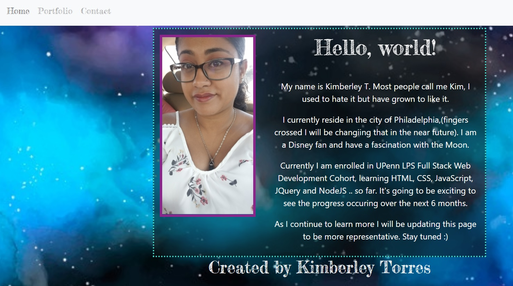
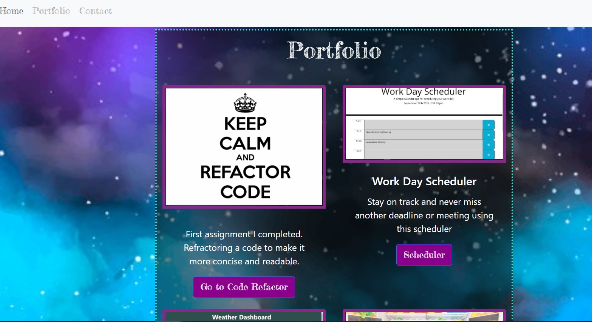
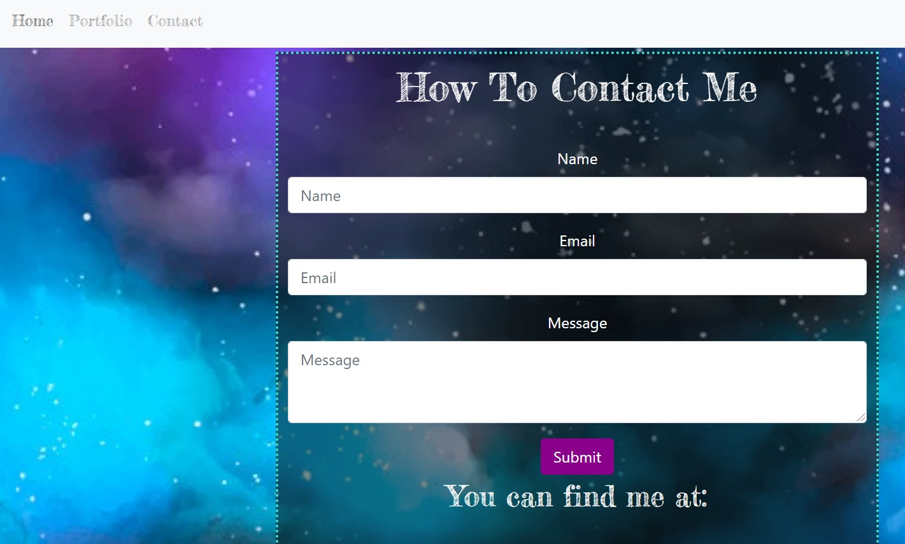

# kt_portfolio

[My Portfolio]()

===================

## Landing Page // Home

## Portfolio

## Contact 

## Description

Update portfolio to showcase more of what we have learned. Include homework assignments and project 1 in portfolio. Also include links to GitHub and LinkedIn on contact page. 

## Installation

Using Bootstrap Framework establish a grid/layout for each individual html to maintain responsiveness in the page.

Any other modifications made in the style were done using a separate stylesheet and linking it to each html file. 

Downloaded some images to personalize the page and saved them directly to the folder of the project so that they will continue to be retrievable and not cause any broken links. In case of an error make sure to include alt description for the image.

## Usage

To get in contact with me there is a form that is on the contact page. I included links to my GitHub and LinkedIn however I did not include a functioning contact box as I presently do not want to get any accidental emails. Further on in the program I will include such details

